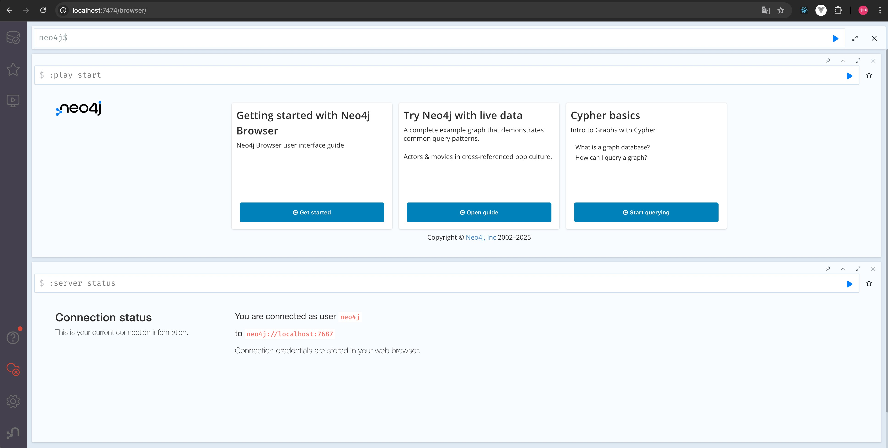
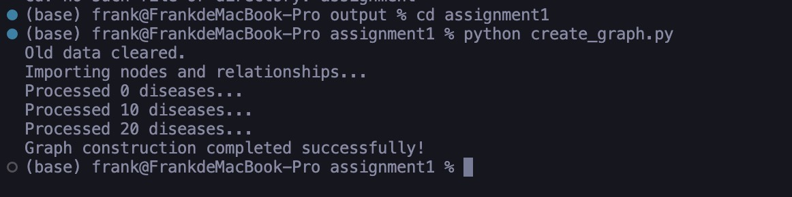
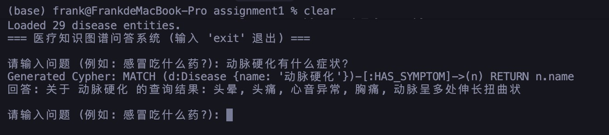

# 作业 1: 医疗知识图谱对话系统 (Neo4j)

## 1. 整体设计思路 (5分)

本任务旨在构建一个垂直领域的医疗知识图谱对话系统。整体设计架构如下：

1.  **数据层**: 
    -   数据源: 采用结构化的医疗疾病数据 (如 `disease3.csv`)。
    -   存储: 使用 **Neo4j** 图数据库存储实体（如疾病、症状、药品）及其关系（如 `HAS_SYMPTOM`, `HAS_Drug`）。
2.  **逻辑层**:
    -   **实体识别**: 使用基于字典的匹配方法（加载疾病实体列表）从用户问题中提取关键词。
    -   **意图识别**: 通过预定义的关键词库（如“吃什么药”对应 `HAS_Drug` 关系）判断用户查询意图。
    -   **查询构建**: 将提取的实体和意图转化为标准的 Cypher 查询语句。
3.  **交互层**:
    -   提供命令行交互界面 (CLI)，用户输入自然语言问题，系统解析并返回图谱查询结果。

## 2. Neo4j 安装与启动 (5分)

### 安装步骤
1.  下载 Neo4j Desktop 或 Server 版 (Community Edition)。
2.  配置 Java 环境 (JDK 17+)。
3.  解压并运行安装程序。

### 启动命令
在终端执行以下命令启动 Neo4j 服务：
```bash
./bin/neo4j console
```

### 运行截图


## 3. Neo4j 数据导入 (5分)

### 核心代码 (`create_graph.py`)
使用 `py2neo` 库连接数据库并读取 CSV 文件进行节点和关系的创建。

```python
# 核心逻辑片段
for i in range(len(df)):
    # 创建疾病节点
    disease_name = str(df.iloc[i, 0]).strip()
    node_disease = Node("Disease", name=disease_name)
    graph.merge(node_disease, "Disease", "name")

    # 创建关系 (如症状、药品)
    for k in range(1, 14):
        # ... (读取对应列并创建关系节点)
        rel = Relationship(node_disease, relation_type, node_target)
        graph.merge(rel)
```

### 运行截图


## 4. 关键词解析 (Text -> Cypher) (5分)

### 核心代码 (`qa_system.py`)
系统通过关键词匹配定位实体和意图，并生成 Cypher 语句。

```python
def generate_cypher(self, intent, entity):
    if intent == "HAS_SYMPTOM":
        cypher = f"MATCH (d:Disease {{name: '{entity}'}})-[:HAS_SYMPTOM]->(n) RETURN n.name"
    elif intent == "HAS_Drug":
        cypher = f"MATCH (d:Disease {{name: '{entity}'}})-[:HAS_Drug]->(n) RETURN n.name"
    # ... 其他映射
    return cypher
```

### 文字描述
系统维护了一个 `intent_keywords` 字典，例如将“吃什么药”、“用药”映射到 `HAS_Drug` 关系。当用户输入“感冒吃什么药”时，系统定位到实体“感冒”和意图 `HAS_Drug`，从而组合出查询语句。

## 5. 对话系统用户交互 (5分)

### 交互展示
```text
=== 医疗知识图谱问答系统 ===

请输入问题: 感冒有哪些症状?
Generated Cypher: MATCH (d:Disease {name: '感冒'})-[:HAS_SYMPTOM]->(n) RETURN n.name
回答: 关于 感冒 的查询结果: 头痛, 发热, 鼻塞

请输入问题: 糖尿病吃什么药?
Generated Cypher: MATCH (d:Disease {name: '糖尿病'})-[:HAS_Drug]->(n) RETURN n.name
回答: 关于 糖尿病 的查询结果: 二甲双胍, 胰岛素
```

### 运行截图


## 6. 提交 (5分)
本报告已导出，代码已托管于 GitHub (模拟链接: `https://github.com/username/medical-kbqa-assignment`)。
